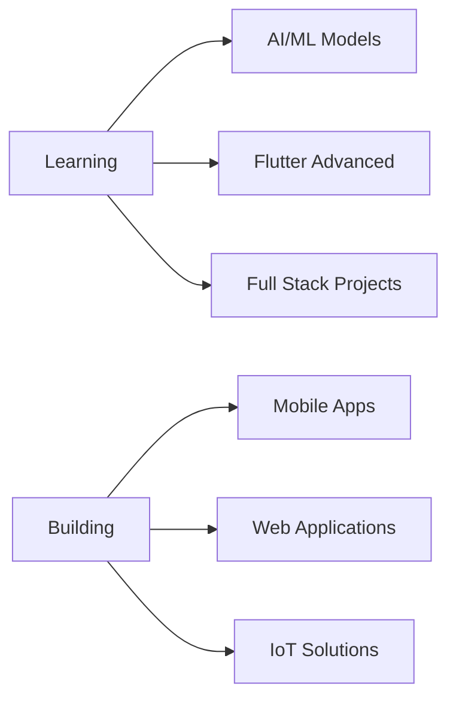

<div align="center">
  
</div>

<div align="center">
  
  [](https://git.io/typing-svg)
  
</div>

<div align="center">
  
</div>

---

## 🚀 About Me

```typescript
const akash = {
    location: "Sri Lanka 🇱🇰",
    currentFocus: ["Web", "Mobile" "AI/ML", "Full Stack Development"],
    expertise: {
        mobile: ["Flutter", "React Native", "Dart"],
        frontend: ["React", "Next.js", "TypeScript", "Tailwind CSS"],
        backend: ["Django", "PHP", "Firebase"],
        aiml: ["Python", "TensorFlow", "Machine Learning"],
        embedded: ["Arduino", "IoT Projects"]
    },
    askMeAbout: ["Mobile Dev", "Web Dev", "AI/ML", "Full Stack Architecture"],
    reachMe: "akashsandeepa11@gmail.com",
    funFact: "I turn coffee into code ☕➡️💻"
};
```

---

## 🛠️ Tech Stack

### 📱 Mobile Development
<p>
  
  
  
  
</p>

### 🌐 Frontend Development
<p>
  
  
  
  
  
  
  
  
  
</p>

### ⚙️ Backend Development
<p>
  
  
  
  
</p>

### 🤖 AI/ML & Data Science
<p>
  
  
  
  
  
</p>

### 🔧 Tools & Platforms
<p>
  
  
  
  
  
  
  
</p>

---

## 📊 GitHub Stats

<div align="center">
  
  
</div>

<div align="center">
  
  
</div>

---

## 🏆 GitHub Trophies

<div align="center">
  
</div>

---

## 💼 What I'm Up To



- 🔭 Building innovative **Flutter** and **React Native** applications
- 🌱 Deepening expertise in **AI/ML** and **Full Stack Development**
- 👯 Open to collaborating on **Mobile**, **Web**, and **AI** projects
- 💡 Exploring **IoT** integration with **Arduino**
- 🎯 Goal: Contributing to impactful open-source projects

---

## 📫 Connect With Me

<div align="center">
  <a href="mailto:akashsandeepa11@gmail.com">
    
  </a>
  <a href="https://fb.com/akash.sandeepa.9">
    
  </a>
  <a href="https://linkedin.com/in/akashsandeepa">
    
  </a>
  <a href="https://github.com/akashsandeepa11">
    
  </a>
</div>

---

## 💭 Random Dev Quote

<div align="center">
  
</div>

---

<div align="center">
  
  
  ### Show some ❤️ by starring some of the repositories!
  
  
</div>
